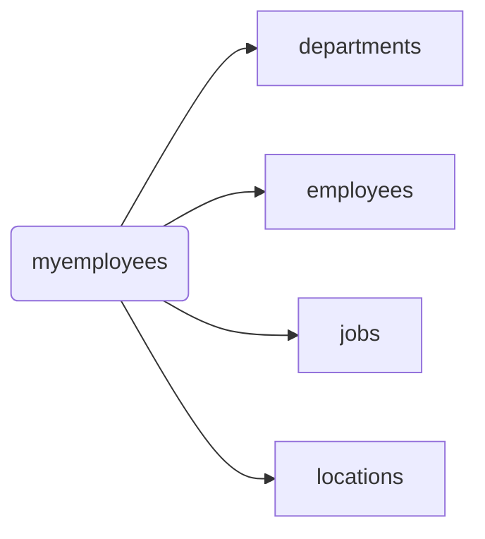

## 数据库基础

[数据库百度词条]: https://baike.baidu.com/item/%E6%95%B0%E6%8D%AE%E5%BA%93/103728?fr=aladdin

### 1.定义

​		数据库是一个按<font color='red'>数据结构</font>来存储和管理数据的计算机软件系统。数据库的概念实际包括两层意思：

​	（1）数据库是一个实体，它是能够合理保管数据的“仓库”，用户在该“仓库”中存放要管理的事务数据，“数据”和“库”两个概念结合成为数据库。

​	（2）数据库是数据管理的新方法和技术，它能更合适的组织数据、更方便的维护数据、更严密的控制数据和更有效的利用数据。


### 2.数据库管理系统

​		数据库管理系统是数据库系统的核心组成部分，主要完成对数据库的操作与管理功能，实现数据库对象的创建、数据库存储数据的<font color='red'>（CRUD）查询、添加、修改与删除</font>操作和数据库的用户管理、权限管理等。它的安全直接关系到整个数据库系统的安全。


### 3.关系型数据库 VS 非关系型数据库（NoSQL）

|          |   关系型数据库   |      非关系型数据库      |
| :------: | :--------------: | :----------------------: |
|   举例   | Mysql、SqlServer | Redis、Memcache、MongoDB |
|   语言   |       SQL        |       没有统一标准       |
| 存储方式 |      行列表      |    键值对、图、文档等    |
| 存储结构 |      结构化      |         动态结构         |
| 扩展方式 |   纵向扩展能力   |       横向扩展能力       |


### 4.结构化查询语言SQL

- 专门用来和数据库通信的语言

- 优点

  - 不是特定数据库提供商专有的，几乎所有的DBMS都支持SQL
  - 简单易学
  - 使用灵活

- 类型

  - DML（Data Manipulation Language):数据<font color='red'>操纵</font>语句，用于CRUD数据库记录，并检查数据完整性

    ```sql
    INSERT：	添加数据到数据库中
    UPDATE：	修改数据库中的数据
    DELETE：	删除数据库中的数据
    SELECT：	选择（查询）数据
    ```
  
  - DDL（Data Definition Language):数据<font color='red'>定义</font>语句，用于库和表的创建、修改、删除
  
    ```sql
    CREATE TABLE：创建数据库表
    ALTER TABLE：更改表结构、添加、删除、修改列长度
    DROP TABLE：删除表
    CREATE INDEX：在表上建立索引
    DROP INDEX：删除索引
    ```
  
  - DCL（Data Control Language):数据<font color='red'>控制</font>语句，用于定义用户的访问权限和安全级别
  
    ```sql
    GRANT：授予访问权限
    REVOKE：撤销访问权限
    COMMIT：提交事务处理
    ROLLBACK：事务处理回退
    SAVEPOINT：设置保存点
    LOCK：对数据库的特定部分进行锁定
    ```
  
  - TCL（Transaction Control Language）：<font color='red'>事务控制</font>font>语言
  
    ```sql
    commit	事务提交
    rollback 事务回滚
    ```
  
    

## MySQL基础


### 1.介绍与安装

MySQL是一款流行的开源数据库。它也是一个关系型数据库管理系统，2008年，mysql被sun公司收购，2009年sun公司被oracle公司收购，自此两个主流的数据库都归Oracle公司收购。

- MySQL的主要优势如下：

  1. 运行速度快。mysql 体积小，命令执行速度快。
  2. 使用成本低。mysql是开源的，且提供免费版本，对大多数用户来说大大降低了使用成本。
  3. 容易使用。与其他大型数据库的设置和管理相比，其复杂程度较低，易于使用。
  4. 可移植性。MySQL 能够运行于多种系统平台上，如window，linux，unix等。
  5. 适用更多用户。mysql支持最常用的数据管理功能，适用于中小型企业甚至大型

- [安装]: https://blog.csdn.net/qq_38269362/article/details/107283338


### 2.MySQL服务的启动和停止

所谓MySQL服务是指一系列关于MySQL软件的后台进程，只有启动了MySQL服务才能对mysql软件进行操作。

- 方式一：右击计算机图标，在’管理’命令中打开计算机管理,选择服务和应用程序，点击服务节点。选择MySQL。

  

- 方式二：通过dos窗口命令行（管理员身份运行）

  ```
  net start mysql
  net stop mysql
  ```


### 3.MySQL服务的登录和退出

- 方式一：通过mysql自带的客户端（MySQL 5.5 Command Line Client 仅限于root用户）

  

- 方式二：通过Windows自带的客户端

  - 登录：<font color='red'>mysql 【-h 主机名 -P 端口号 】-u 用户名 -p【密码】</font>

  - 退出：<font color='red'>exit 或ctrl+C</font>

  


### 4.MySQL常见命令

​	注：sql命令以分号结尾

- #### 查看当前所有的数据库
  
  <font color='red'>show databases;</font>
  
- #### 打开指定的库
  
  <font color='red'>use 库名;</font>
  
- #### 查看当前库的所有表
  
  <font color='red'>show tables;</font>
  
- #### 查看其它库的所有表
  
  <font color='red'>show tables from 库名;</font>
  
- #### 创建表
  
  <font color='red'>create table 表名(</font>
  
  <font color='red'>列名 列类型,</font>
  <font color='red'>列名 列类型，</font>
  <font color='red'>...	...);</
  
- #### 查看表结构
  
  <font color='red'>desc 表名;</font>font>
  
- #### 查看sql服务器版本

  - sql命令:select version();
  - dos命令:mysql --version 或 mysql --V

```sql
#查看当前所有数据库
mysql> show databases;
+--------------------+
| Database           |
+--------------------+
| information_schema |
| mysql              |
| performance_schema |
| test               |
+--------------------+
4 rows in set (0.00 sec)

#打开指定数据库
mysql> use information_schema;
Database changed

#查看当前库中所有表
mysql> show tables;
+---------------------------------------+
| Tables_in_information_schema          |
+---------------------------------------+
| CHARACTER_SETS                        |
| COLLATIONS                            |
| COLLATION_CHARACTER_SET_APPLICABILITY |
| COLUMNS                               |
......
+---------------------------------------+
37 rows in set (0.00 sec)

#查看指定库中所有表
mysql> show tables from mysql;
+---------------------------+
| Tables_in_mysql           |
+---------------------------+
| columns_priv              |
| db                        |
| event                     |
| func                      |
......
+---------------------------+
24 rows in set (0.06 sec)

mysql> use test;
Database changed

mysql> show tables;
Empty set (0.00 sec)

#在当前库创建表
mysql> create table stu_info(
    -> id int,
    -> name varchar(20));
Query OK, 0 rows affected (0.02 sec)

mysql> show tables;
+----------------+
| Tables_in_test |
+----------------+
| stu_info       |
+----------------+
1 row in set (0.00 sec)

#查看指定表的表结构
mysql> desc stu_info;
+-------+-------------+------+-----+---------+-------+
| Field | Type        | Null | Key | Default | Extra |
+-------+-------------+------+-----+---------+-------+
| id    | int(11)     | YES  |     | NULL    |       |
| name  | varchar(20) | YES  |     | NULL    |       |
+-------+-------------+------+-----+---------+-------+
2 rows in set (0.02 sec)

#查询
mysql> select * from stu_info;
Empty set (0.01 sec)

#插入
mysql> insert into stu_info (id,name) values(1,'zlx');
Query OK, 1 row affected (0.01 sec)

mysql> insert into stu_info (id,name) values(2,'zzx');
Query OK, 1 row affected (0.01 sec)

mysql> select * frome stu_info;
ERROR 1064 (42000): You have an error in your SQL syntax; check the manual that corresponds to your MySQL server version for the right syntax to use near 'frome stu_info' at line 1
mysql> select * from stu_info;
+------+------+
| id   | name |
+------+------+
|    1 | zlx  |
|    2 | zzx  |
+------+------+
2 rows in set (0.00 sec)

#更新
mysql> update stu_info set name='lili' where id=2;
Query OK, 1 row affected (0.01 sec)
Rows matched: 1  Changed: 1  Warnings: 0

mysql> select * from stu_info;
+------+------+
| id   | name |
+------+------+
|    1 | zlx  |
|    2 | lili |
+------+------+
2 rows in set (0.00 sec)

#删除
mysql> delete from stu_info where id=2;
Query OK, 1 row affected (0.01 sec)

mysql> select * from stu_info;
+------+------+
| id   | name |
+------+------+
|    1 | zlx  |
+------+------+
1 row in set (0.00 sec)

mysql> select version();
+-----------+
| version() |
+-----------+
| 5.5.15    |
+-----------+
1 row in set (0.01 sec)

mysql> exit
Bye

C:\Windows\system32>mysql --version
mysql  Ver 14.14 Distrib 5.5.15, for Win32 (x86)
```


### 5.MySQL语法规范

- 1.不区分大小写,但建议关键字大写，表名、列名小写
- 2.每条命令最好用分号结尾（\g也可以）
  3.每条命令根据需要，可以进行缩进 或换行（建议关键字单独一行）
- 4.注释
  	单行注释：#注释文字
  	单行注释：-- 注释文字
  	多行注释：/* 注释文字  */


## DQL语言的学习

数据库结构：



### 1.基础查询

- <font color='red'>语法：select  要查询的字段|表达式|常量值|函数  from  表名;</font>

```sql
/*
语法：select 要查询的字段|表达式|常量值|函数 from 表名;
*/
#(1)查询表中单个字段
SELECT `last_name` FROM employees ;

#(2)查询表中多个字段
SELECT 
  `last_name`,
  `salary`,
  `email` 
FROM
  employees ;

#(3)查询所有字段 
SELECT * FROM employees

#(4)查询常量值
SELECT 100

#(5)查询表达式
SELECT 100%98

#(6)查询函数
SELECT VERSION();

#(7)为字段起别名
/*
-便于理解
-如果要查询的字段有重名的情况，使用别名可以区分开来
*/
#方式1
SELECT 100%98 AS 结果
SELECT last_name AS 姓,first_name AS 名 FROM employees
#方式2
SELECT last_name 姓, first_name 名 FROM employees
#别名中含特殊符号(用双引号)
SELECT salary AS "out put" FROM employees

#(8)去重(关键字：distinct)
SELECT DISTINCT department_id FROM employees

#（9）+号的作用
/*
select 100+90;两个操作数都为数值型，则做加法运算
其中一方为字符型，试图将字符型转换为数值型
select '100'+90;	=190
select 'John'+90;	=0+90=90
select null+90;只要其中一方为null,则结果肯定为null
*/

#(10)拼接(关键字：concat)
SELECT CONCAT(last_name,first_name) AS 姓名 FROM employees
```


### 2.条件查询

- <font color='red'>语法：select  查询字段  from  表名  while 筛选条件;  </font>

- 条件表达式：>  <  >=  <=  =  !=  <>

  ```sql
  /*
  按条件表达式筛选
  */
  #案例一：查询工资>12000的员工信息
  SELECT
  	*
  FROM
  	employees
  WHERE
  	salary>12000;
  
  #案例二：查询部门编号不等于90的员工名和部门编号
  SELECT
  	last_name,
  	department_id
  FROM 
  	employees
  WHERE 
  	department_id<>90;
  ```

- 逻辑表达式：

  - and（&&）:两个条件如果同时成立，结果为true，否则为false

  - or(||)：两个条件只要有一个成立，结果为true，否则为false

  - not(!)：如果条件成立，则not后为false，否则为true

    ```sql
    /*
    按逻辑表达式筛选
    */
    #案例一：查询工资在10000到20000之间的员工名、工资以及奖金
    SELECT
    	last_name,
    	salary,
    	commission_pct
    FROM
    	employees
    WHERE 	
    	salary>=10000 AND salary<=20000;
    	
    #案例二：查询部门编号不是在90到110之间，或者工资高于15000的员工信息
    SELECT
    	*
    FROM
    	employees
    WHERE
    	NOT(department_id>=90 AND department_id<=110) OR salary>15000;
    ```

- 模糊查询：

  - like

    ```sql
    #-------like
    #案例一：查询员工名字以s开头的员工信息（通配符：%任意多个字符，_任意单个字符）
    SELECT
    	*
    FROM 
    	employees
    WHERE
    	last_name LIKE 's%'
    
    #案例二：查询员工名字中第三个字符为i,第四个字符为e的员工名和工资
    SELECT
    	last_name,
    	salary
    FROM
    	employees
    WHERE
    	last_name LIKE '__i_e%' 
    	
    /*
    转义字符 \
    自定义转义字符 '$' ESCAPE '$'
    */
    ```

  - between and

    ```sql
    #--------between and（可以替换 <  and  >）
    #案例：查询员工号在100到120之间的员工信息
    SELECT
    	*
    FROM
    	employees
    WHERE 
    	employee_id BETWEEN 100 AND 120
    
    ```

  - in

    ```sql
    #------in（可以替换 = or = or = ……）
    #案例：查询员工的工种编号是 IT_PROG、AD_VP、AD_PRES中的一个的员工名和工种编号
    SELECT
    	last_name,
    	job_id
    FROM
    	employees
    WHERE
    	job_id='IT_PROG' OR job_id='AD_VP' OR job_id='AD_PRES';
    	
    SELECT
    	last_name,
    	job_id
    FROM
    	employees
    WHERE
    	job_id IN ('IT_PROG','AD_VP','AD_PRES');
    ```

  - is null | is not null

    ```sql
    #----is （not）null
    /*
    判断null值不能用 = 和 <>,而要用 is 和 is not
    也可以用安全等于 <=>
    */
    #案例一：查询没有奖金的员工名和奖金率
    SELECT
    	last_name,
    	commission_pct
    FROM
    	employees
    WHERE
    	commission_pct IS NULL
    	
    SELECT
    	last_name,
    	commission_pct
    FROM
    	employees
    WHERE
    	commission_pct <=> NULL
    	
    #案例二：查询有奖金的员工名和奖金率
    SELECT
    	last_name,
    	commission_pct
    FROM
    	employees
    WHERE
    	commission_pct IS NOT NULL
    	
    #案例三：查询员工号为176的姓名、部门号和年薪
    /*
    年薪=salary*12*(1+年薪率)
    年薪率可能为NULL，为NULL时当作0
    年薪=salary*12*(1+IFNULL(commission_pct,0))
    */
    SELECT
    	last_name,
    	department_id,
    	salary*12*(1+IFNULL(commission_pct,0)) AS 年薪
    FROM
    	employees
    ```
    
    

### 3.排序查询  

- <font color='red'>语法：select  要查询的东西  from  表 【where 条件】 order by 排序的字段|表达式|别名|函数 【asc|desc】</font>  

  ```sql
  /*
  语法:
  select 要查询的东西
  from 表
  【where 条件】
  order by 排序的字段|表达式|别名|函数 【asc|desc】
  */
  
  #案例一：查询员工信息，要求按工资从高到低排序
  SELECT *
  FROM employees
  ORDER BY salary ASC;
  
  #案例二：查询部门编号>=90的员工信息，按入职时间的先后排序
  SELECT * 
  FROM employees 
  WHERE department_id >= 90 
  ORDER BY hiredate ASC;
  
  #案例三：按年薪高低显示员工的信息和年薪【按表达式|别名排序】
  SELECT *,salary*12*(1+IFNULL(commission_pct,0)) 年薪
  FROM employees
  ORDER BY salary*12*(1+IFNULL(commission_pct,0)) DESC;
  
  SELECT *,salary*12*(1+IFNULL(commission_pct,0)) 年薪
  FROM employees
  ORDER BY 年薪 DESC;
  
  #案例四：按姓名的长度显示员工信姓名和工资【按函数排序】
  SELECT LENGTH(last_name) 姓名长度,last_name,salary
  FROM employees
  ORDER BY LENGTH(last_name) DESC;
  
  #案例五：查询员工信息，要求先按工资升序排序，如果工资相同，再按员工编号降序排序【按多个字段排序】
  SELECT *
  FROM employees
  ORDER BY salary ASC,employee_id DESC;			
  ```


### 4.单行函数  

#### （1）字符函数

```sql
#(1)length()：获取参数值的字节个数(汉字占3个字节)
select length('john');
select length('张三丰');

#(2)concat():拼接字符串
select concat(last_name,'_',first_name) from employees;

#(3)upper()、lower():转换为大/小写
select concat(upper(last_name),lower(first_name)) 姓名 from employees;

#(4)substr():截取字符串	注意：索引从1开始
#--截取从指定索引处开始后面所有字符
select substr('李莫愁爱上了陆展元',7) output;

#--截取从指定索引处开始指定长度字符
select substr('李莫愁爱上了陆展元',1,3) output;

#案例：姓名中首字符大写，其他字符小写，用—连接，显示处理
select concat(upper(substr(last_name,1,1)),substr(last_name,2),'-',lower(first_name))
as 姓名 from employees;

#(5)instr():返回字串第一次出现的索引，如果找不到则返回0
select instr('杨不悔爱上了殷六侠','爱上') as output;

#(6)trim():去除字符串前后空格或指定字符
select trim('     张翠山     ') as output;
select trim('a' from 'aaaaaaa张aaa翠山aaaaa') as output;

#(7)lpad():用指定字符串左填充到指定长度
select lpad('殷素素',10,'&') as output;

#(8)rpad():用指定字符串右填充到指定长度
select rpad('殷素素','10','$') as output;

#(9)replace():替换字符串
select replace('张无忌爱上了周芷若周芷若','周芷若','赵敏');
```

#### （2）数学函数

```sql
#(1)round:四舍五入
SELECT ROUND(1.55);
SELECT ROUND(1.235,2);

#(2)ceil:向上取整,返回>=该参数的最小整数
SELECT CEIL(1.1);
SELECT CEIL(-2.1);

#(3)floor:向下取整，返回<=该参数的最大整
SELECT FLOOR(-9.99);

#(4)truncate:截断
SELECT TRUNCATE(-1.2234,2);

#(5)mod:取余函数
/*
取余原理：
mod(a,b):= a-(a/b)*b
mod(-10,-3)=-10-(-10/-3)*(-3)=-10-(-9)=-1
*/
SELECT MOD(10,3);
SELECT MOD(10,-3);
```

#### （3）日期函数

```sql
#now 返回当前系统日期+时间
SELECT NOW();

#curdate 返回当前日期
SELECT CURDATE();

#curtime 返回当前时间
SELECT CURTIME();

#获取指定部分的年、月、日、小时、分、秒
SELECT YEAR(NOW()) 年;
SELECT YEAR('1999-10-10') 年;

SELECT MONTH(NOW()) 月;
SELECT MONTHNAME(NOW()) 月名;

#将字符串转换为日期
SELECT STR_TO_DATE('3-3-1999','%c-%d-%Y') AS out_put

#将日期转换为字符
SELECT DATE_FORMAT(hiredate,'%m月/%d日 %y年') AS out_put
FROM employees;
```

#### （5）其他函数

```sql
SELECT VERSION();
SELECT DATABASE();
SELECT USER();
```

#### （6）流程控制函数

```sql
#(1)if函数：if else 效果
SELECT IF(10<5,'小','大');

SELECT 
	last_name,
	commission_pct,
	IF(commission_pct IS NULL,'没有奖金','有奖金') AS 备注
FROM employees;

#(2)case函数：作为一个新字段，与前面字段用逗号隔开
#--switch case的效果
/*
case 要判断的表达式
when 常量1 then 要显示的值1或语句1；
when 常量2 then 要显示的值2或语句2；
...
else 要显示的值n或语句n;
end
*/
/*
案例：查询员工的工资，要求
部门号=30，显示工资1.1倍
部门号=40，显示工资1.2倍
部门号=50，显示工资1.3倍
其他部门，显示原工资
*/
SELECT salary AS 原始工资,department_id,
CASE department_id
WHEN 30 THEN salary*1.1
WHEN 40 THEN salary*1.2
WHEN 50 THEN salary*1.3
ELSE salary
END
AS 新工资
FROM employees;

#--多重if的效果
/*
case 
when 表达式1 then 要显示的值1或语句1；
when 表达式2 then 要显示的值2或语句2；
...
else 要显示的值n或语句n;
end
*/
/*
案例：查询工资级别，要求
工资>20000,显示A级别
工资>15000，显示B级别
工资<15000,显示C级别
*/
SELECT last_name,salary,
CASE 
WHEN salary>20000 THEN 'A'
WHEN salary>15000 THEN 'B'
WHEN salary>10000 THEN 'C'
ELSE 'D'
END AS 工资级别
FROM employees
```


### 5.分组函数    

```sql
/*
功能：做统计使用，又称为聚合函数、统计函数或组函数
sum 求和、avg 平均值、max 最大值、min 最小值、count 计算个数
*/

#1.简单使用
SELECT SUM(salary) AS 工资总和 FROM employees;
SELECT MAX(salary) AS 最高工资 FROM employees;
SELECT MIN(salary) AS 最低工资 FROM employees;
SELECT AVG(salary) AS 平均工资 FROM employees;
SELECT COUNT(salary) AS 有工资的人数 FROM employees;
SELECT SUM(salary)/COUNT(salary) AS 平均工资 FROM employees;

#2.参数支持那些类型
/*
sum,avg 一般处理数值型；
max,min,count 可以处理任何类型；
*/
SELECT SUM(last_name),AVG(last_name) FROM employees;

SELECT MAX(last_name),MIN(last_name) FROM employees;

#3.以上分组函数都忽略null值；
SELECT IF(COUNT(commission_pct)-COUNT(salary)<>0,'不相等','相等') 
FROM employees;

#4.和distinct搭配
#查看有几种工资
SELECT COUNT(DISTINCT salary) FROM employees;

#5.count函数的详细介绍
#统计表的行数（不忽略null值）
SELECT COUNT(*) FROM employees;
SELECT COUNT(1) FROM employees;	#除了1可以是任意常量值

#6.和分组函数一同查询的字段要求是group by后的字段
```

​        

### 6.分组查询		   			

### 7.连接查询	 				

### 8.子查询                     

### 9.分页查询                  

### 10.union联合查询
