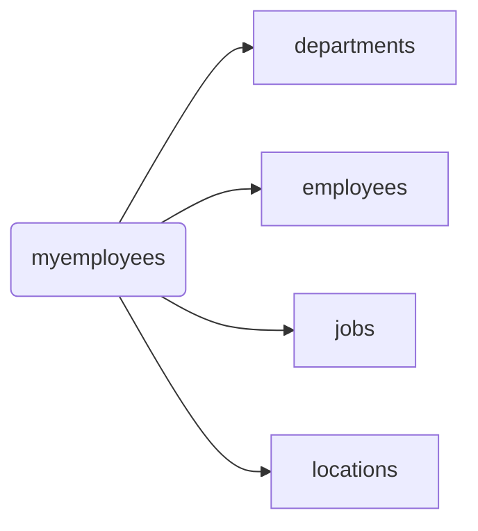

## 数据库基础

[数据库百度词条]: https://baike.baidu.com/item/%E6%95%B0%E6%8D%AE%E5%BA%93/103728?fr=aladdin

### 1.定义

​		数据库是一个按<font color='red'>数据结构</font>来存储和管理数据的计算机软件系统。数据库的概念实际包括两层意思：

​	（1）数据库是一个实体，它是能够合理保管数据的“仓库”，用户在该“仓库”中存放要管理的事务数据，“数据”和“库”两个概念结合成为数据库。

​	（2）数据库是数据管理的新方法和技术，它能更合适的组织数据、更方便的维护数据、更严密的控制数据和更有效的利用数据。


### 2.数据库管理系统

​		数据库管理系统是数据库系统的核心组成部分，主要完成对数据库的操作与管理功能，实现数据库对象的创建、数据库存储数据的<font color='red'>（CRUD）查询、添加、修改与删除</font>操作和数据库的用户管理、权限管理等。它的安全直接关系到整个数据库系统的安全。


### 3.关系型数据库 VS 非关系型数据库（NoSQL）

|          |   关系型数据库   |      非关系型数据库      |
| :------: | :--------------: | :----------------------: |
|   举例   | Mysql、SqlServer | Redis、Memcache、MongoDB |
|   语言   |       SQL        |       没有统一标准       |
| 存储方式 |      行列表      |    键值对、图、文档等    |
| 存储结构 |      结构化      |         动态结构         |
| 扩展方式 |   纵向扩展能力   |       横向扩展能力       |


### 4.结构化查询语言SQL

- 专门用来和数据库通信的语言

- 优点

  - 不是特定数据库提供商专有的，几乎所有的DBMS都支持SQL
  - 简单易学
  - 使用灵活

- 类型

  - DML（Data Manipulation Language):数据<font color='red'>操纵</font>语句，用于CRUD数据库记录，并检查数据完整性

    ```sql
    INSERT：	添加数据到数据库中
    UPDATE：	修改数据库中的数据
    DELETE：	删除数据库中的数据
    SELECT：	选择（查询）数据
    ```
  
  - DDL（Data Definition Language):数据<font color='red'>定义</font>语句，用于库和表的创建、修改、删除
  
    ```sql
    CREATE TABLE：创建数据库表
    ALTER TABLE：更改表结构、添加、删除、修改列长度
    DROP TABLE：删除表
    CREATE INDEX：在表上建立索引
    DROP INDEX：删除索引
    ```
  
  - DCL（Data Control Language):数据<font color='red'>控制</font>语句，用于定义用户的访问权限和安全级别
  
    ```sql
    GRANT：授予访问权限
    REVOKE：撤销访问权限
    COMMIT：提交事务处理
    ROLLBACK：事务处理回退
    SAVEPOINT：设置保存点
    LOCK：对数据库的特定部分进行锁定
    ```
  
  - TCL（Transaction Control Language）：<font color='red'>事务控制</font>font>语言
  
    ```sql
    commit	事务提交
    rollback 事务回滚
    ```
  
    

## MySQL基础


### 1.介绍与安装

MySQL是一款流行的开源数据库。它也是一个关系型数据库管理系统，2008年，mysql被sun公司收购，2009年sun公司被oracle公司收购，自此两个主流的数据库都归Oracle公司收购。

- MySQL的主要优势如下：

  1. 运行速度快。mysql 体积小，命令执行速度快。
  2. 使用成本低。mysql是开源的，且提供免费版本，对大多数用户来说大大降低了使用成本。
  3. 容易使用。与其他大型数据库的设置和管理相比，其复杂程度较低，易于使用。
  4. 可移植性。MySQL 能够运行于多种系统平台上，如window，linux，unix等。
  5. 适用更多用户。mysql支持最常用的数据管理功能，适用于中小型企业甚至大型

- [安装]: https://blog.csdn.net/qq_38269362/article/details/107283338


### 2.MySQL服务的启动和停止

所谓MySQL服务是指一系列关于MySQL软件的后台进程，只有启动了MySQL服务才能对mysql软件进行操作。

- 方式一：右击计算机图标，在’管理’命令中打开计算机管理,选择服务和应用程序，点击服务节点。选择MySQL。

  

- 方式二：通过dos窗口命令行（管理员身份运行）

  ```
  net start mysql
  net stop mysql
  ```


### 3.MySQL服务的登录和退出

- 方式一：通过mysql自带的客户端（MySQL 5.5 Command Line Client 仅限于root用户）

  

- 方式二：通过Windows自带的客户端

  - 登录：<font color='red'>mysql 【-h 主机名 -P 端口号 】-u 用户名 -p【密码】</font>

  - 退出：<font color='red'>exit 或ctrl+C</font>

  


### 4.MySQL常见命令

​	注：sql命令以分号结尾

- #### 查看当前所有的数据库
  
  <font color='red'>show databases;</font>
  
- #### 打开指定的库
  
  <font color='red'>use 库名;</font>
  
- #### 查看当前库的所有表
  
  <font color='red'>show tables;</font>
  
- #### 查看其它库的所有表
  
  <font color='red'>show tables from 库名;</font>
  
- #### 创建表
  
  <font color='red'>create table 表名(</font>
  
  <font color='red'>列名 列类型,</font>
  <font color='red'>列名 列类型，</font>
  <font color='red'>...	...);</
  
- #### 查看表结构
  
  <font color='red'>desc 表名;</font>font>
  
- #### 查看sql服务器版本

  - sql命令:select version();
  - dos命令:mysql --version 或 mysql --V

```sql
#查看当前所有数据库
mysql> show databases;
+--------------------+
| Database           |
+--------------------+
| information_schema |
| mysql              |
| performance_schema |
| test               |
+--------------------+
4 rows in set (0.00 sec)

#打开指定数据库
mysql> use information_schema;
Database changed

#查看当前库中所有表
mysql> show tables;
+---------------------------------------+
| Tables_in_information_schema          |
+---------------------------------------+
| CHARACTER_SETS                        |
| COLLATIONS                            |
| COLLATION_CHARACTER_SET_APPLICABILITY |
| COLUMNS                               |
......
+---------------------------------------+
37 rows in set (0.00 sec)

#查看指定库中所有表
mysql> show tables from mysql;
+---------------------------+
| Tables_in_mysql           |
+---------------------------+
| columns_priv              |
| db                        |
| event                     |
| func                      |
......
+---------------------------+
24 rows in set (0.06 sec)

mysql> use test;
Database changed

mysql> show tables;
Empty set (0.00 sec)

#在当前库创建表
mysql> create table stu_info(
    -> id int,
    -> name varchar(20));
Query OK, 0 rows affected (0.02 sec)

mysql> show tables;
+----------------+
| Tables_in_test |
+----------------+
| stu_info       |
+----------------+
1 row in set (0.00 sec)

#查看指定表的表结构
mysql> desc stu_info;
+-------+-------------+------+-----+---------+-------+
| Field | Type        | Null | Key | Default | Extra |
+-------+-------------+------+-----+---------+-------+
| id    | int(11)     | YES  |     | NULL    |       |
| name  | varchar(20) | YES  |     | NULL    |       |
+-------+-------------+------+-----+---------+-------+
2 rows in set (0.02 sec)

#查询
mysql> select * from stu_info;
Empty set (0.01 sec)

#插入
mysql> insert into stu_info (id,name) values(1,'zlx');
Query OK, 1 row affected (0.01 sec)

mysql> insert into stu_info (id,name) values(2,'zzx');
Query OK, 1 row affected (0.01 sec)

mysql> select * frome stu_info;
ERROR 1064 (42000): You have an error in your SQL syntax; check the manual that corresponds to your MySQL server version for the right syntax to use near 'frome stu_info' at line 1
mysql> select * from stu_info;
+------+------+
| id   | name |
+------+------+
|    1 | zlx  |
|    2 | zzx  |
+------+------+
2 rows in set (0.00 sec)

#更新
mysql> update stu_info set name='lili' where id=2;
Query OK, 1 row affected (0.01 sec)
Rows matched: 1  Changed: 1  Warnings: 0

mysql> select * from stu_info;
+------+------+
| id   | name |
+------+------+
|    1 | zlx  |
|    2 | lili |
+------+------+
2 rows in set (0.00 sec)

#删除
mysql> delete from stu_info where id=2;
Query OK, 1 row affected (0.01 sec)

mysql> select * from stu_info;
+------+------+
| id   | name |
+------+------+
|    1 | zlx  |
+------+------+
1 row in set (0.00 sec)

mysql> select version();
+-----------+
| version() |
+-----------+
| 5.5.15    |
+-----------+
1 row in set (0.01 sec)

mysql> exit
Bye

C:\Windows\system32>mysql --version
mysql  Ver 14.14 Distrib 5.5.15, for Win32 (x86)
```


### 5.MySQL语法规范

- 1.不区分大小写,但建议关键字大写，表名、列名小写
- 2.每条命令最好用分号结尾（\g也可以）
  3.每条命令根据需要，可以进行缩进 或换行（建议关键字单独一行）
- 4.注释
  	单行注释：#注释文字
  	单行注释：-- 注释文字
  	多行注释：/* 注释文字  */


## DQL语言

数据库结构：



### 1.基础查询

- <font color='red'>语法：select  要查询的字段|表达式|常量值|函数  from  表名;</font>

```sql
/*
语法：select 要查询的字段|表达式|常量值|函数 from 表名;
*/
#(1)查询表中单个字段
SELECT `last_name` FROM employees ;

#(2)查询表中多个字段
SELECT 
  `last_name`,
  `salary`,
  `email` 
FROM
  employees ;

#(3)查询所有字段 
SELECT * FROM employees

#(4)查询常量值
SELECT 100

#(5)查询表达式
SELECT 100%98

#(6)查询函数
SELECT VERSION();

#(7)为字段起别名
/*
-便于理解
-如果要查询的字段有重名的情况，使用别名可以区分开来
*/
#方式1
SELECT 100%98 AS 结果
SELECT last_name AS 姓,first_name AS 名 FROM employees
#方式2
SELECT last_name 姓, first_name 名 FROM employees
#别名中含特殊符号(用双引号)
SELECT salary AS "out put" FROM employees

#(8)去重(关键字：distinct)
SELECT DISTINCT department_id FROM employees

#（9）+号的作用
/*
select 100+90;两个操作数都为数值型，则做加法运算
其中一方为字符型，试图将字符型转换为数值型
select '100'+90;	=190
select 'John'+90;	=0+90=90
select null+90;只要其中一方为null,则结果肯定为null
*/

#(10)拼接(关键字：concat)
SELECT CONCAT(last_name,first_name) AS 姓名 FROM employees
```


### 2.条件查询

- <font color='red'>语法：select  查询字段  from  表名  while 筛选条件;  </font>

- 条件表达式：>  <  >=  <=  =  !=  <>

  ```sql
  /*
  按条件表达式筛选
  */
  #案例一：查询工资>12000的员工信息
  SELECT
  	*
  FROM
  	employees
  WHERE
  	salary>12000;
  
  #案例二：查询部门编号不等于90的员工名和部门编号
  SELECT
  	last_name,
  	department_id
  FROM 
  	employees
  WHERE 
  	department_id<>90;
  ```

- 逻辑表达式：

  - and（&&）:两个条件如果同时成立，结果为true，否则为false

  - or(||)：两个条件只要有一个成立，结果为true，否则为false

  - not(!)：如果条件成立，则not后为false，否则为true

    ```sql
    /*
    按逻辑表达式筛选
    */
    #案例一：查询工资在10000到20000之间的员工名、工资以及奖金
    SELECT
    	last_name,
    	salary,
    	commission_pct
    FROM
    	employees
    WHERE 	
    	salary>=10000 AND salary<=20000;
    	
    #案例二：查询部门编号不是在90到110之间，或者工资高于15000的员工信息
    SELECT
    	*
    FROM
    	employees
    WHERE
    	NOT(department_id>=90 AND department_id<=110) OR salary>15000;
    ```

- 模糊查询：

  - like

    ```sql
    #-------like
    #案例一：查询员工名字以s开头的员工信息（通配符：%任意多个字符，_任意单个字符）
    SELECT
    	*
    FROM 
    	employees
    WHERE
    	last_name LIKE 's%'
    
    #案例二：查询员工名字中第三个字符为i,第四个字符为e的员工名和工资
    SELECT
    	last_name,
    	salary
    FROM
    	employees
    WHERE
    	last_name LIKE '__i_e%' 
    	
    /*
    转义字符 \
    自定义转义字符 '$' ESCAPE '$'
    */
    ```

  - between and

    ```sql
    #--------between and（可以替换 <  and  >）
    #案例：查询员工号在100到120之间的员工信息
    SELECT
    	*
    FROM
    	employees
    WHERE 
    	employee_id BETWEEN 100 AND 120
    
    ```

  - in

    ```sql
    #------in（可以替换 = or = or = ……）
    #案例：查询员工的工种编号是 IT_PROG、AD_VP、AD_PRES中的一个的员工名和工种编号
    SELECT
    	last_name,
    	job_id
    FROM
    	employees
    WHERE
    	job_id='IT_PROG' OR job_id='AD_VP' OR job_id='AD_PRES';
    	
    SELECT
    	last_name,
    	job_id
    FROM
    	employees
    WHERE
    	job_id IN ('IT_PROG','AD_VP','AD_PRES');
    ```

  - is null | is not null

    ```sql
    #----is （not）null
    /*
    判断null值不能用 = 和 <>,而要用 is 和 is not
    也可以用安全等于 <=>
    */
    #案例一：查询没有奖金的员工名和奖金率
    SELECT
    	last_name,
    	commission_pct
    FROM
    	employees
    WHERE
    	commission_pct IS NULL
    	
    SELECT
    	last_name,
    	commission_pct
    FROM
    	employees
    WHERE
    	commission_pct <=> NULL
    	
    #案例二：查询有奖金的员工名和奖金率
    SELECT
    	last_name,
    	commission_pct
    FROM
    	employees
    WHERE
    	commission_pct IS NOT NULL
    	
    #案例三：查询员工号为176的姓名、部门号和年薪
    /*
    年薪=salary*12*(1+年薪率)
    年薪率可能为NULL，为NULL时当作0
    年薪=salary*12*(1+IFNULL(commission_pct,0))
    */
    SELECT
    	last_name,
    	department_id,
    	salary*12*(1+IFNULL(commission_pct,0)) AS 年薪
    FROM
    	employees
    ```
    
    

### 3.排序查询  

- <font color='red'>语法：select  要查询的东西  from  表 【where 条件】 order by 排序的字段|表达式|别名|函数 【asc|desc】</font>  

  ```sql
  /*
  语法:
  select 要查询的东西
  from 表
  【where 条件】
  order by 排序的字段|表达式|别名|函数 【asc|desc】
  */
  
  #案例一：查询员工信息，要求按工资从高到低排序
  SELECT *
  FROM employees
  ORDER BY salary ASC;
  
  #案例二：查询部门编号>=90的员工信息，按入职时间的先后排序
  SELECT * 
  FROM employees 
  WHERE department_id >= 90 
  ORDER BY hiredate ASC;
  
  #案例三：按年薪高低显示员工的信息和年薪【按表达式|别名排序】
  SELECT *,salary*12*(1+IFNULL(commission_pct,0)) 年薪
  FROM employees
  ORDER BY salary*12*(1+IFNULL(commission_pct,0)) DESC;
  
  SELECT *,salary*12*(1+IFNULL(commission_pct,0)) 年薪
  FROM employees
  ORDER BY 年薪 DESC;
  
  #案例四：按姓名的长度显示员工信姓名和工资【按函数排序】
  SELECT LENGTH(last_name) 姓名长度,last_name,salary
  FROM employees
  ORDER BY LENGTH(last_name) DESC;
  
  #案例五：查询员工信息，要求先按工资升序排序，如果工资相同，再按员工编号降序排序【按多个字段排序】
  SELECT *
  FROM employees
  ORDER BY salary ASC,employee_id DESC;			
  ```


### 4.单行函数  

- 字符函数

```sql
#(1)length()：获取参数值的字节个数(汉字占3个字节)
select length('john');
select length('张三丰');

#(2)concat():拼接字符串
select concat(last_name,'_',first_name) from employees;

#(3)upper()、lower():转换为大/小写
select concat(upper(last_name),lower(first_name)) 姓名 from employees;

#(4)substr():截取字符串	注意：索引从1开始
#--截取从指定索引处开始后面所有字符
select substr('李莫愁爱上了陆展元',7) output;

#--截取从指定索引处开始指定长度字符
select substr('李莫愁爱上了陆展元',1,3) output;

#案例：姓名中首字符大写，其他字符小写，用—连接，显示处理
select concat(upper(substr(last_name,1,1)),substr(last_name,2),'-',lower(first_name))
as 姓名 from employees;

#(5)instr():返回字串第一次出现的索引，如果找不到则返回0
select instr('杨不悔爱上了殷六侠','爱上') as output;

#(6)trim():去除字符串前后空格或指定字符
select trim('     张翠山     ') as output;
select trim('a' from 'aaaaaaa张aaa翠山aaaaa') as output;

#(7)lpad():用指定字符串左填充到指定长度
select lpad('殷素素',10,'&') as output;

#(8)rpad():用指定字符串右填充到指定长度
select rpad('殷素素','10','$') as output;

#(9)replace():替换字符串
select replace('张无忌爱上了周芷若周芷若','周芷若','赵敏');
```

- 数学函数

```sql
#(1)round:四舍五入
SELECT ROUND(1.55);
SELECT ROUND(1.235,2);

#(2)ceil:向上取整,返回>=该参数的最小整数
SELECT CEIL(1.1);
SELECT CEIL(-2.1);

#(3)floor:向下取整，返回<=该参数的最大整
SELECT FLOOR(-9.99);

#(4)truncate:截断
SELECT TRUNCATE(-1.2234,2);

#(5)mod:取余函数
/*
取余原理：
mod(a,b):= a-(a/b)*b
mod(-10,-3)=-10-(-10/-3)*(-3)=-10-(-9)=-1
*/
SELECT MOD(10,3);
SELECT MOD(10,-3);
```

- 日期函数

```sql
#now 返回当前系统日期+时间
SELECT NOW();

#curdate 返回当前日期
SELECT CURDATE();

#curtime 返回当前时间
SELECT CURTIME();

#获取指定部分的年、月、日、小时、分、秒
SELECT YEAR(NOW()) 年;
SELECT YEAR('1999-10-10') 年;

SELECT MONTH(NOW()) 月;
SELECT MONTHNAME(NOW()) 月名;

#将字符串转换为日期
SELECT STR_TO_DATE('3-3-1999','%c-%d-%Y') AS out_put

#将日期转换为字符
SELECT DATE_FORMAT(hiredate,'%m月/%d日 %y年') AS out_put
FROM employees;
```

- 其他函数

```sql
SELECT VERSION();
SELECT DATABASE();
SELECT USER();
```

- 流程控制函数

```sql
#(1)if函数：if else 效果
SELECT IF(10<5,'小','大');

SELECT 
	last_name,
	commission_pct,
	IF(commission_pct IS NULL,'没有奖金','有奖金') AS 备注
FROM employees;

#(2)case函数：作为一个新字段，与前面字段用逗号隔开
#--switch case的效果
/*
case 要判断的表达式
when 常量1 then 要显示的值1或语句1；
when 常量2 then 要显示的值2或语句2；
...
else 要显示的值n或语句n;
end
*/
/*
案例：查询员工的工资，要求
部门号=30，显示工资1.1倍
部门号=40，显示工资1.2倍
部门号=50，显示工资1.3倍
其他部门，显示原工资
*/
SELECT salary AS 原始工资,department_id,
CASE department_id
WHEN 30 THEN salary*1.1
WHEN 40 THEN salary*1.2
WHEN 50 THEN salary*1.3
ELSE salary
END
AS 新工资
FROM employees;

#--多重if的效果
/*
case 
when 表达式1 then 要显示的值1或语句1；
when 表达式2 then 要显示的值2或语句2；
...
else 要显示的值n或语句n;
end
*/
/*
案例：查询工资级别，要求
工资>20000,显示A级别
工资>15000，显示B级别
工资<15000,显示C级别
*/
SELECT last_name,salary,
CASE 
WHEN salary>20000 THEN 'A'
WHEN salary>15000 THEN 'B'
WHEN salary>10000 THEN 'C'
ELSE 'D'
END AS 工资级别
FROM employees
```


### 5.分组函数    

```sql
/*
功能：做统计使用，又称为聚合函数、统计函数或组函数
sum 求和、avg 平均值、max 最大值、min 最小值、count 计算个数
*/

#1.简单使用
SELECT SUM(salary) AS 工资总和 FROM employees;
SELECT MAX(salary) AS 最高工资 FROM employees;
SELECT MIN(salary) AS 最低工资 FROM employees;
SELECT AVG(salary) AS 平均工资 FROM employees;
SELECT COUNT(salary) AS 有工资的人数 FROM employees;
SELECT SUM(salary)/COUNT(salary) AS 平均工资 FROM employees;

#2.参数支持那些类型
/*
sum,avg 一般处理数值型；
max,min,count 可以处理任何类型；
*/
SELECT SUM(last_name),AVG(last_name) FROM employees;

SELECT MAX(last_name),MIN(last_name) FROM employees;

#3.以上分组函数都忽略null值；
SELECT IF(COUNT(commission_pct)-COUNT(salary)<>0,'不相等','相等') 
FROM employees;

#4.和distinct搭配
#查看有几种工资
SELECT COUNT(DISTINCT salary) FROM employees;

#5.count函数的详细介绍
#统计表的行数（不忽略null值）
SELECT COUNT(*) FROM employees;
SELECT COUNT(1) FROM employees;	#除了1可以是任意常量值

#6.和分组函数一同查询的字段要求是group by后的字段
```

​        

### 6.分组查询	

- 语法：<font color='red'>select column,group_function(column)</font>
  		  <font color='red'>from table</font>
      		<font color='red'> [where condition]</font>
      		 <font color='red'>[group by group_by_expression]</font>
      		 <font color='red'>[order by column]</font>
      		 <font color='red'>[having condition]</font> 

- tip:

  - 查询列表比较特殊，要求是分组函数和group by后出现的字段(每个...)；
  - 先按照where筛选条件进行分组，然后根据分组函数查询对应的值,最后进行having筛选

- 简单的分组查询

  ```sql
  #案例1：查询每个部门的平均工资
  SELECT department_id,AVG(salary) 平均工资
  FROM employees
  GROUP BY department_id
  ORDER BY AVG(salary) DESC
  
  #案例2：查询每个工种的最高工资
  SELECT job_id,MAX(salary) 最高工资
  FROM employees
  GROUP BY job_id
  
  #案例3：查询每个位置上的部门个数
  SELECT COUNT(*),location_id
  FROM departments
  GROUP BY location_id
  ```

  ​		

- where筛选条件：先where筛选再分组，where筛选是在未分组的原始表上进行的

  ```sql
  #案例1：查询邮箱中包含a字符，每个部门的平均工资
  SELECT AVG(salary),department_id
  FROM employees
  WHERE email LIKE '%a%'
  GROUP BY department_id;
  
  #案例2：查询每个领导手下有奖金的员工的最高工资
  SELECT MAX(salary),manager_id
  FROM employees
  WHERE commission_pct IS NOT NULL
  GROUP BY manager_id;
  ```

  

- having筛选条件：先查询在having筛选，having筛选是在查询结果集上进行的	

  ```sql
  #案例1：查询哪个部门的员工个数大于2
  #错误写法：count(*)>2是筛选的整个原始表
  SELECT department_id,COUNT(*) 员工个数
  FROM employees
  WHERE COUNT(*)>2
  GROUP BY department_id;
  
  #正确写法：（1）先分组查询每个部门的员工个数；（2）根据结果再过滤查询员工个数大于2的部门
  SELECT department_id,COUNT(*) 员工个数
  FROM employees
  GROUP BY department_id
  HAVING COUNT(*)>2;
  ```


- 混合筛选条件

  ```sql
  #案例1：查询每个工种"有奖金的"员工的"最高工资>12000的"工种编号和最高工资
  /*
  筛选条件1：有奖金的
  筛选条件2：最高工资>12000
  分组条件：每个工种
  思路：先筛选出有奖金的项，按照工种分组，查询出每个分组的最高工资和工种编号，最后从结果集筛选出最高工资大于12000的
  */
  SELECT job_id,MAX(salary)
  FROM employees
  WHERE commission_pct IS NOT NULL
  GROUP BY job_id
  HAVING MAX(salary)>12000;
  
  #案例2：查询“领导编号>102的“每个领导手下的”最低工资>5000的“领导编号以及最低工资
  /*
  筛选条件1：领导编号>102
  筛选条件2：最低工资>5000
  分组条件：每个领导
  思路：先筛选领导编号>102的项，按照领导编号分组，查询出领导编号和最低工资，最后从结果集筛选出最低工资<5000的
  */
  SELECT manager_id,MIN(salary)
  FROM employees
  WHERE manager_id>102
  GROUP BY manager_id
  HAVING MIN(salary)>5000；
  ```

  

### 7.连接查询

#### （1）分类：

```
按年代分类：
	sq129标准：仅支持内连接（等值、非等值、自连接）
	sql199标准【推荐】支持内连接+外连接（左外连接、右外连接）+交叉连接
	
按功能分：
	内连接：
		等值连接
		非等职连接
		自连接
	外连接：
		左外连接
		右外连接
		全外连接
	交叉连接
```


#### （2）SQL192标准

- 等值连接

```sql
#案例1：查询女生名对应的男生名
SELECT `name`,boyName FROM beauty,boys
WHERE beauty.boyfriend_id = boys.id;

#案例2：查询员工名和对应的部门名
SELECT last_name,department_name
FROM employees,departments
WHERE employees.`department_id`=departments.`department_id`;

#为表名起别名
#案例1：查询员工号、工种号、工种名
SELECT last_name,employees.job_id,job_title
FROM employees,jobs
WHERE employees.`job_id`=jobs.`job_id`;

SELECT last_name,e.job_id,job_title
FROM employees AS e,jobs AS j
WHERE e.`job_id`=j.`job_id`;

#加筛选条件
#案例1：查询有奖金的员工们和部门名
SELECT last_name,department_name
FROM employees e,departments d
WHERE e.`department_id`=d.`department_id`
AND e.`commission_pct` IS NOT NULL; 
```


- 非等值连接

```sql
#案例1：查询员工的工资和工资级别
SELECT salary,grade_level
FROM employees,job_grades g
WHERE salary BETWEEN g.`lowest_sal` AND `highest_salary`;
```


- 自连接

```sql
#3.自连接
#案例1：查询员工名和上级的名称
SELECT e1.last_name 员工名,e2.last_name 领导名
FROM employees e1,employees e2
WHERE e1.manager_id = e2.employee_id
```


#### （3）SQL199标准

- 语法：

  	select 查询列表
  	from 表1 别名 【连接类型】
  	join 表2 别名
  	on 连接条件
  	【where 筛选条件】
  	【group by 分组】
  	【having 筛选条件】
  	【order by 排序列表】

- 分类

  ```
  分类：
  	内连接：inner
  	外连接：
  		左外：left 【outer】
  		右外：right 【outer】
  		全外：full 【outer】
  	交叉连接：cross
  ```

- 内连接

  - 语法
    	select 查询列表
    	from 表1 别名
    	inner join 表2 别名
    	On 连接条件
  - 等值连接

  ```sql
  #（1）等值连接
  #案例1：查询员工名和对应的部门名
  SELECT last_name,department_name
  FROM employees e
  INNER JOIN departments d
  ON e.`department_id`=d.`department_id`
  
  #案例2：查询有奖金的员工们和部门名
  SELECT last_name,department_name
  FROM employees e
  INNER JOIN departments d
  ON e.`department_id`=d.`department_id`
  WHERE e.`commission_pct` IS NOT NULL; 
  ```

  - 非等值连接

  ```sql
  #（2）非等值连接
  #案例1：查询员工的工资和工资级别
  SELECT salary,grade_level
  FROM employees e
  INNER JOIN job_grades g
  ON e.salary BETWEEN g.`lowest_sal` AND `highest_salary`;
  ```

  - 子连接

  ```sql
  #（3）自连接
  #案例1：查询员工名和上级的名称
  SELECT e1.last_name 员工名,e2.last_name 领导名
  FROM employees e1
  INNER JOIN employees e2
  ON e1.manager_id = e2.employee_id
  ```

- 外连接

```sql
/*
应用场景：一个表中有，另外一个表没有的记录
1.外连接查询结果为主表中的所有记录
	如果从表中有和它匹配的，则显示匹配的值
	如果没有和它匹配的，则显示null
	外连接查询结果=内连接结果+主表中有而从表中没有的记录
	
2.left join:左边是主表
right join:右边是主表
*/
#案例1：查询男朋友不在男生表中女生名
select be.name,bo.*
from beauty be
left outer join boys bo
on be.`boyfriend_id`=bo.`id`
where bo.`id` is null;

#案例2：查询哪个部门没有员工
select d.*,e.employee_id
from departments d
left outer join employees e
on d.`department_id` = e.`department_id`
where e.`employee_id` is null
```


- 交叉连接

```sql
#交叉连接（笛卡尔乘积）
SELECT be.*,bo.*
FROM beauty be
CROSS JOIN boys bo;
```


### 8.子查询 

- 说明：当一个查询语句中又嵌套了另外一个select语句，则倍嵌套的select语句称为子查询或内查询           
- 分类：  
  1. select后面：
     	要求：子查询的结果为单行多列（标量子查询）
  2. from后面
     	要求：子查询的结果可以为多行多列
  3. where或having后面
     	要求：子查询的结果必须为单列
     		单行子查询
     		多行子查询
  4. exists后面
     	要求：子查询结果必须为单列（相关子查询）
- 特点：
  	子查询要包含在括号中；
  	子查询放在比较条件右侧
  	子查询的查询优先于主查询
  	单行子查询对应了 单行操作符：> < <= >= = <>
  	多行子查询对应了 多行操作符：any/some  all in


- 单行子查询

  ```sql
  #案例1.查询和Zlotkey相同部门的员工姓名和工资名
  #(1)查询Zlotkey的部门编号
  SELECT department_id 
  FROM employees
  WHERE last_name = 'Zlotkey';
  
  #(2)查询department_id=(1)的员工工资和姓名
  SELECT last_name,salary
  FROM employees
  WHERE department_id = (
  	SELECT department_id 
  	FROM employees
  	WHERE last_name = 'Zlotkey'
  );
  
  #案例2.查询工资比公司平均工资高的员工姓名和工资
  SELECT last_name,salary
  FROM employees
  WHERE salary >= (
  	SELECT AVG(salary)
  	FROM employees
  )
  ```


- 多行子查询

  ```sql
  /*
  in:判断某字段是否在列表内
  
  any/some:判断某字段的值是否满足任意一个
  x>any() <=> x>min()
  x=any() <=> x in ()
  x<any() <=> x<max()
  
  all:判断某字段的值是否满足所有
  x>all() <=> x>max()
  x<all() <=> x<max()
  */
  #案例1：返回location_id是1400或1700的部门中的所有员工姓名
  SELECT last_name	
  FROM employees
  WHERE department_id IN (
  	SELECT DISTINCT department_id
  	FROM departments
  	WHERE location_id IN (1400,1700)
  );
  
  #案例2：返回其他部门中比job_id为IT_PROG部门中任意工资低的员工号、姓名、job_id、salary
  SELECT * 
  FROM employees
  WHERE salary < ANY(
  	SELECT DISTINCT salary
  	FROM employees
  	WHERE job_id = 'IT_PROG'
  ) AND job_id <> 'IT_PROG'
  
  SELECT * 
  FROM employees
  WHERE salary < (
  	SELECT  MAX(salary)
  	FROM employees
  	WHERE job_id = 'IT_PROG'
  ) AND job_id <> 'IT_PROG';
  ```

  


- 放在from后面

  ```sql
  #案例：查询每个部门的平均工资的工资级别
  #（1）每个部门的平均工资
  SELECT AVG(salary),department_id
  FROM employees
  GROUP BY department_id
  
  #(2)连接：查询平均工资的工资级别
  SELECT dep_ag.department_id,dep_ag.ag,g.grade
  FROM sal_grade g
  JOIN (
  	SELECT AVG(salary) ag,department_id
  	FROM employees
  	GROUP BY department_id
  ) dep_ag ON dep_ag.ag BETWEEN g.min_salary AND g.max_salary;
  ```

- 放在exists后面

  ```sql
  #案例：查询有无名字叫“张三丰”的员工
  SELECT EXISTS(
  	SELECT *
  	FROM employees
  	WHERE last_name = '张三丰'
  ) 有无;
  ```

  

### 9.分页查询  

- 语法：

  select 查询列表
  from 表1 别名
  join 表2 别名
  where 筛选条件
  group by 分组
  having 分组后筛选
  order by 排序列表
  limit 起始条目索引(默认0)，显示的条目数

- 执行顺序：

  1.from
  2.join
  3.on
  4.where
  5.group by
  6.having
  7.select
  8.order by
  9.limit

- 公式：

  如果要显示的页数是page,每页显示的条目数是size

  **select *
  from employees
  limit (page-1)*size,size;**

  | page | size=10 |
  | ---- | ------- |
  |1	|limit 0,10|
  |2	|limit 10,10|
  |3	|limit 20,10|
  |4	|limit 30,10|

- 案例

  ```sql
  #案例1：查询员工信息的前五条
  SELECT * FROM employees LIMIT 5
  SELECT * FROM employees LIMIT 0,5
  
  #案例2：查询有奖金的，员工工资较高的第11名到第20名
  SELECT last_name,salary
  FROM employees
  WHERE commission_pct IS NOT NULL
  ORDER BY salary DESC
  LIMIT 10,10
  ```

  

### 10.union联合查询

- 说明：查询结果之间没有关联，这个时候往往使用联合查询（union查询）

- 语法：

  select 字段|常量|表达式|函数 【from 表】 【where 条件】 union 【all】
  select 字段|常量|表达式|函数 【from 表】 【where 条件】 union 【all】
  select 字段|常量|表达式|函数 【from 表】 【where 条件】 union  【all】
  .....
  select 字段|常量|表达式|函数 【from 表】 【where 条件】

- 注意：

  - 要求列数相等
  - union自动去重/union all 支持重复项

- 案例

  ```sql
  #案例：
  SELECT `name` FROM beauty
  UNION
  SELECT `boyname` FROM boys
  ```

  

## DML语言

Date Manipulation Language

### 1.插入insert

#### （1）方式一

- 语法：

  <font color='red'>insert into 表名(列名1，...) </font>

  <font color='red'>values(值1，...)，values(值1，...)，...</font>

- 插入的值的类型要与列的类型一致,且一一对应

  ```sql
  INSERT INTO beauty(id,NAME,sex,borndate,phone,photo,boyfriend_id)
  VALUES(13,'唐艺昕','女','1990-4-23','19822223333',NULL,2);
  ```

- 可以为null的列如何插入值

  ```sql
  #方式一(对应值写null)
  INSERT INTO beauty(id,NAME,sex,borndate,phone,photo,boyfriend_id)
  VALUES(13,'唐艺昕','女','1990-4-23','19822223333',NULL,2);
  
  #方式二（不写列名）
  INSERT INTO beauty(id,NAME,sex,borndate,phone,boyfriend_id)
  VALUES(14,'金星','女','1990-4-23','19822223333',2);
  ```

- 列的顺序可以调换

  ```sql
  INSERT INTO beauty(NAME,sex,phone,id)
  VALUES('蒋欣','女','1235677764',15);
  ```

- 可以省略列名，默认所有列，且列的顺序和表中列的顺序一致

  ```sql
  INSERT INTO beauty
  VALUES(16,'张飞','男',NULL,'119',NULL,NULL);
  ```


#### （2）方式二

- 语法：

  <font color='red'>insert into 表名</font>

  <font color='red'>set 列名1=值1，列名2=值2，...</font>

  ```sql
  INSERT INTO beauty
  SET id=17,NAME='刘涛',phone='1928384940984'
  ```


#### （3）两者对比

- 方式一支持插入多行，方式二不支持

  ```sql
  INSERT INTO beauty
  VALUES(18,'唐艺昕','女','1990-4-23','19822223333',NULL,2),
  (19,'唐艺昕','女','1990-4-23','19822223333',NULL,2),
  (20,'唐艺昕','女','1990-4-23','19822223333',NULL,2);
  ```

  

- 方式一支持子查询，方式二不支持

  ```sql
  INSERT INTO beauty(id,NAME,phone)
  SELECT 21,'宋茜','123478583493';
  ```


### 2.修改update

#### （1）修改单表

- 语法：

  <font color='red'>update 表名</font>

  <font color='red'>set 列=新值，列=新值</font>

  <font color='red'>where 筛选条件;</font>

- 案例

  ```sql
  #案例1：修改beauty表中姓唐的电话为000000000
  UPDATE beauty
  SET phone='000000000'
  WHERE NAME LIKE '唐%'
  
  #案例2：修改boys表中id为2的名称为张飞，魅力值为10
  UPDATE boys
  SET boyname='张飞',userCP=10
  WHERE id=2;
  ```

  

#### （2）修改多表

- 语法：

  - SQL192语法：

    <font color='red'>update 表1 别名，表2 别名</font>

    <font color='red'>set 列=值，...</font>

    <font color='red'>where 连接条件</font>

    <font color='red'>and 筛选条件</font>

  - SQL199语法：【推荐】

    <font color='red'>update 表1 别名</font>

    <font color='red'>inner|left|right join 表2 别名</font>

    <font color='red'>on 连接条件</font>

    <font color='red'>set 列=值，...</font>

    <font color='red'>where 筛选条件</font>

- 案例：

  ```sql
  #案例1：修改张无忌的女朋友的手机号为11111111
  UPDATE boys bo
  INNER JOIN beauty be 
  ON bo.`id`=be.`boyfriend_id`
  SET phone='1111111111'
  WHERE bo.boyName='张无忌';
  
  #案例2：修改没有男朋友的女生的男朋友编号都为2
  #(1)左外连接
  SELECT * FROM
  beauty be LEFT OUTER JOIN boys bo
  ON be.`boyfriend_id`=bo.`id`
  
  UPDATE beauty be
  LEFT OUTER JOIN boys bo 
  ON be.`boyfriend_id`=bo.`id`
  SET boyfriend_id=2
  WHERE boyfriend_id IS NULL
  
  #(2)右外连接
  SELECT * FROM
  boys bo RIGHT OUTER JOIN beauty be
  ON bo.`id`=be.`boyfriend_id`
  
  UPDATE boys bo 
  LEFT OUTER JOIN beauty be
  ON bo.`id`=be.`boyfriend_id`
  SET boyfriend_id=2
  WHERE boyfriend_id IS NULL
  ```

  

### 3.删除delete

#### （1）单表的删除

- 语法：<font color='red'>delete from 表名 where 筛选条件</font>

- 案例：

  ```sql
  #案例：删除手机号以9结尾的女神信息
  DELETE FROM beauty WHERE phone LIKE '%9'
  ```

  

#### （2）多表的删除

- 语法：

  - SQL192标准

    ​		delete 表1的别名，表2的别名 （要删除哪个表的记录就写哪个表别名）
    ​		from 表1 别名，表2 别名
    ​		where 连接条件
    ​		and 筛选条件

  - SQL199标准【推荐】

    ​		<font color='red'>delete 表1的别名，表2的别名</font>
    ​		<font color='red'>from 表1 别名</font>
    ​		<font color='red'>inner|left|right| join 表2 别名</font>
    ​		<font color='red'>on 连接条件</font>
    ​		<font color='red'>where 筛选条件</font>

- 案例：

  ```sql
  #案例：删除张无忌女朋友的信息
  DELETE be
  FROM boys bo 
  JOIN beauty be
  ON be.`boyfriend_id`=bo.`id`
  WHERE bo.`boyName`='张无忌';
  
  #案例：删除黄晓明及其女朋友的信息
  DELETE be,bo
  FROM boys bo 
  JOIN beauty be
  ON be.`boyfriend_id`=bo.`id`
  WHERE bo.`boyName`='黄晓明';
  ```

  

#### （3）truncate

- 语法：<font color='red'>truncate table 表名；</font>
- truncate table boys 与 delete from boys 对比 【<font color='red'>面试题</font>】
  - 1.都能清空表数据
  - 2.truncate删除效率稍微高一点点
  - 3.用delete删除在插入数据，自增长序列的值从断点开始；用truncate删除再插入数据，自增长序列的值从1开始
  - 4.delete删除有返回值；truncate删除没有返回值
  - 5.truncate删除后不能回滚，delete删除可以回滚


## DDL语言

Data Definition language

### 1.库的管理

#### （1）库的创建

- 语法：<font color='red'>create database 库名</font>

  ```sql
  CREATE DATABASE books;
  #如果库不存在则创建
  CREATE DATABASE IF NOT EXISTS books;
  ```

  

#### （2）库的修改

- 语法：rename datebase 库名 to 新库名;【不安全，已废弃】


#### （3）库的删除

- 语法：<font color='red'>drop database 库名</font>

  ```sql
  DROP DATABASE books;
  #如果存在则删除
  DROP DATABASE IF EXISTS books;
  ```

  

### 2.表的管理

#### （1）表的创建

- 语法：

  <font color='red'>create table 表名(</font>	列名 列的类型 [(长度) 约束],
  <font color='red'>	列名 列的类型 [(长度) 约束],</font>

  <font color='red'>	列名 列的类型 [(长度) 约束],</font>

  ​	<font color='red'>...</font>
  ​	<font color='red'>列名 列的类型 [(长度) 约束],</font>

- 案例：

  ```sql
  #案例：创建表book
  USE books;
  CREATE TABLE IF NOT EXISTS book(
  	id INT,#编号
  	bName VARCHAR(20),#书名
  	price DOUBLE,#价格
  	author VARCHAR(20),#作者编号
  	pulishDate DATETIME#出版日期
  );
  DESC book;
  
  #案例：创建表author
  CREATE TABLE author(
  	id INT,
  	au_name VARCHAR(20),
  	nation VARCHAR(20)
  )
  DESC author;
  ```

  

#### （2）表的修改

- 语法：<font color='red'>alter table 表名 add|drop|modify|change column</font>

- 修改列名

  ```sql
  ALTER TABLE book CHANGE COLUMN publishDate pubData DATETIME;
  ```

  

- 修改列的类型或约束

  ```sql
  ALTER TABLE book MODIFY COLUMN pubData TIMESTAMP;
  ```

  

- 添加新列

  ```sql
  ALTER TABLE author ADD COLUMN annual DOUBLE; #年薪
  ```

  

- 删除列

  ```sql
  ALTER TABLE author DROP COLUMN annual;
  ALTER TABLE author DROP COLUMN IF NOT EXISTS annual;
  ```

  

- 修改表名

  ```sql
  ALTER TABLE author RENAME TO book_author;
  ```

  

#### （3）表的复制

- 仅复制表的结构

  ```sql
  CREATE TABLE copy LIKE author;
  ```

  

- 复制表的结构+数据

  ```sql
  CREATE TABLE copy1 SELECT * FROM author;
  ```

  

- 仅复制部分数据

  ```sql
  CRATE TABLE CREATE TABLE copy2
  SELECT id,au_name
  FROM author
  WHERE nation='中国';copy1 SELECT * FROM author;
  ```

  

- 仅复制部分结构

  ```sql
  CREATE TABLE copy3
  SELECT id,au_name
  FROM author
  WHERE 1=2; #恒不成立，没有数据
  ```

  

#### （4）表的删除

```sql
DROP TABLE book_author;
DROP TABLE IF EXISTS book_author;
```


### 3.数据类型

#### （1）整型

- |  整型类型   | 字节 |                             范围                             |
  | :---------: | :--: | :----------------------------------------------------------: |
  |   tinyint   |  1   |               有符号：-128~127   无符号：0~255               |
  |  smallint   |  2   |            有符号：-32768~32767   无符号：0~65535            |
  |  mediumint  |  3   |        有符号：-8388608~8388607    无符号：0~1677215         |
  | int\integer |  4   |     有符号：- 2147483648~2147483647 无符号：0~4294967295     |
  |   bigint    |  8   | 有符号：-9223372036854775808~9223372036854775807 无符号：0~9223372036854775807*2+1 |

- 特点：

  - a.默认是有符号，如果要设置无符号，需要添加关键字unsigned
  - b.如果插入的数值超出了整型的范围，会报out of range异常，并且插入临界值
    c.如果不设置长度，会有默认长度。
  - 长度代表了显示的最大宽度，如果不够会用0在左边填充，但必须搭配zerofill使用

- 如何设置无符号

  ```sql
  CREATE TABLE tab_int(
  	t1 INT,
  	t2 INT UNSIGNED,
  	t3 INT(8) ZEROFILL
  );
  ```

  

#### （2）小数

- |        浮点数类型        | 字节 |                           范围                            |
  | :----------------------: | :--: | :-------------------------------------------------------: |
  |          float           |  4   |             ±1.75494351E-38~±3.402823466E+38              |
  |          double          |  8   |     ±2.2250738585072014E-308~±1.7976931348623157E+308     |
  |        定点数类型        | 字节 |                           范围                            |
  | dec(M,D)    decimal(M,D) | M+2  | 最大取值范围与double相同，给定decimal的有效取值范围由M和D |

  

#### （3）字符型

- char和varchar


|    写法    |           M的意思           |                  特点                   |  空间消耗  | 效率 |
| :--------: | :-------------------------: | :-------------------------------------: | :--------: | :--: |
|  char(M)   | 最大字符数，可以省略默认为1 | <font color='red'>固定长度的字符</font> | </比较耗费 |  高  |
| varchar(M) |   最大字符数，不可用省略    | <font color='red'>可变长度的字符</font> |  比较节省  |  低  |

​	当存储的字段的字符数固定时用char;当存储的字段的字符数变化时用varchar


- enum 枚举型

  ```sql
  CREATE TABLE tab_char(
  	c1 ENUM('a','b','c')
  );
  INSERT INTO tab_char VALUES('a'),('b'),('c'),('d'),('A');
  ```

  

- set 集合型

  ```sql
  CREATE TABLE tab_set(
  	c1 set('a','b','c')
  );
  INSERT INTO tab_set VALUES('a'),('A,b'),('a,c'),('a,b,c');
  ```


#### （4）日期型

|日期和时间类型|字节 |最小值|最大值|
| :--------: | :--------: | :-------: | :-------: |
| date | 4 | 1000-01-01 | 9999-12-31 |
|datetime |8 |1000-01-01 00:00:00 |9999-12-31 23:59:59|
|timestamp |4 |19700101080001 |2038年的某个时刻|
|time |3 |-838:59:59 |838:59:59|
|year |1 |1901 |2155|

```sql
CREATE TABLE tab_date(
	t1 DATETIME,
	t2 TIMESTAMP
);

INSERT INTO tab_date VALUES(NOW(),NOW());
SELECT * FROM tab_date;
#改时区
SHOW VARIABLES LIKE 'time_zone';
SET time_zone='+9:00'
```


### 4.常见约束

#### （1）介绍

- 含义：一种限制，用于限制表中的数据，为了保证表中数据的准确可靠性
- 分类：六大约束
  - NOT NULL：非空。用于保证该字段非空（如姓名、学号）
  - DEFAULT：默认。用于保证该字段有默认值（如姓名）
  - PRIMARY KEY：主键。用于保证该字段唯一且非空（如学号、员工编号）
  - UNIQUE：唯一。用于保证该字段的值唯一性，可以为空（如座位号）
  - CHECK：检查【mysql不支持】。（如年龄、性别）
  - FOREIGIN KEY：外键。用于限制两个表的关系，用于保证该字段的值必须来自于主表的关联列的值。在从表中添加外键约束，用于引用主表中某列的值（比如学生表的专业编号，员工表的部门编号，员工表的工种编号）

- 添加约束的时机：
  	1.创建表时
  	2.修改表时
- 约束的添加分类：
  	列级约束（六大约束都支持，但foreign key没有效果
  	表级约束（除了<font color='red'>非空、默认</font>，其他都支持）

#### （2）创建表时添加约束

- 1.添加列级约束

  - 语法：

    <font color='red'>create table 表名(</font>	

    ​    <font color='red'>字段名 字段类型 列级约束，</font>
    ​	<font color='red'>字段名 字段类型 列级约束，</font>
    ​	<font color='red'>...</font>
    <font color='red'>)</font>

  - 举例

  ```sql
  CREATE DATABASE students;
  USE students;
  
  CREATE TABLE major(
  	id INT PRIMARY KEY,
  	marjorName VARCHAR(20)
  );
  
  CREATE TABLE stuinfo(
  	id INT PRIMARY KEY, 		  #主键
  	stuName VARCHAR(20) NOT NULL, #非空
  	gender CHAR(1) CHECK(gender='男' OR gender='女'),#检查
  	seat INT UNIQUE, 	#唯一
  	age INT DEFAULT 18, #默认
  	marjorId INT REFERENCES major(id) #外键：引用marjor表中的id为外键
  );
  
  #查看约束信息
  DESC stuinfo;
  #查看stuinfo表中所有的索引，包括主键、外键、唯一
  SHOW INDEX FROM stuinfo;
  ```

  

- 2.添加表级约束

  - 语法：

    <font color='red'>create table 表名(</font>	

    ​	<font color='red'>字段名 字段类型,</font>
    ​	<font color='red'>字段名 字段类型,</font>
    ​	<font color='red'>...</font>
    ​	<font color='red'>constraint [约束名] 约束类型（字段名，</font>
    ​	<font color='red'>constraint [约束名] 约束类型（字段名）</font>
    ​	<font color='red'>...</font>
    <font color='red'>)</font>

  - 举例

  ```sql
  DROP TABLE IF EXISTS stuinfo;
  
  CREATE TABLE stuinfo(
  	id INT,
  	stuName VARCHAR(20),
  	gender CHAR(1),
  	seat INT,
  	majorId INT,
  	CONSTRAINT pk PRIMARY KEY(id), #主键
  	CONSTRAINT uq UNIQUE(seat),	   #唯一
  	CONSTRAINT ck CHECK(gender='男' OR gender='女'),#检查
  	CONSTRAINT fk_stuinfo_major FOREIGN KEY(majorid) REFERENCES major(id)#外键
  ); 
  ```


- 3.通用的写法（表级约束写外键约束）

  ```sql
  CREATE TABLE IF NOT EXISTS studinfo(
  	id INT PRIMARY KEY,
  	stuName VARCHAR(20) NOT NULL,
  	gender CHAR(1) CHECK(gender='男' OR gender='女'),
  	age INT DEFAULT 18,
  	seat INT UNICODE,
  	marjorId INT,
  	CONSTRAINT fk_stuinfo_major FOREIGN KEY(majorId) REFERENCES major(id)
  );
  ```


- 4.primary key VS unique
| |保证唯一性|是否允许为空	|一个表中可有几个|
| ---- | ----- | ------| ----- |
|PRIMARY KEY    | √			|×		|一个|
|UNIQUE 		| √			|√		|多个|

  

- 5.foreign key
    ​	1.要求在从表设置外键关系
    ​	2.从表中外键列的类型和主表的关联列的类型要求一致或兼容，名称可以不一样
    ​	3.要求主表中的关联列必须是一个key(主键或唯一键）
    ​	4.插入数据时，先插入主表，再插入从表；删除数据时，先删除从表，再删除主表


#### (3)修改表时添加约束

- 语法：

  添加列级约束：
  	<font color='red'>alter table 表名 modify column 字段名 字段类型 新约束;</font>
  	
  添加表级约束：
  	<font color='red'>alter table 表名 add 【constraint 约束名】 约束类型(字段名) 【外键的引用】 </font>

  

- 举例：

  ```sql
  #1.添加非空约束
  ALTER TABLE stuinfo MODIFIER COLUMN stuName VARCHAR(20) NOT NULL;
  
  #2.添加默认约束
  ALTER TABLE stuinfo MODIFY age INT DEFAULT 18;
  
  #3.添加主键
  #（1）列级约束
  ALTER TABLE stuinfo MODIFIER COLUMN id INT PRIMARY KEY;
  #（2）表级约束
  ALTER TABLE stuinfo ADD PRIMARY KEY(id);
  
  #4.添加唯一键
  #（1）列级约束
  ALTER TABLE stuinfo MODIFY COLUMN id INT UNIQUE;
  #（2）表级约束
  ALTER TABLE stuinfo ADD UNIQUE(seat);
  
  #5.添加外键
  ALTER TABLE stuinfo ADD FOREIGN KEY(majorId) REFERENCES major(id);
  ALTER TABLE stuinfo ADD CONSTRAINT fk_sutinfo_major FOREIGN KEY(majorId) REFERENCES major(id);
  ```

  

#### （4）修改表时删除约束

```sql
#1.删除非空约束
ALTER TABLE stuinfo MODIFY COLUMN stuName VARCHAR(20) NULL;

#2.删除默认约束
ALTER TABLE stuinfo MODIFIER COLUMN age INT;

#3.删除主键
ALTER TABLE stuinfo DROP PRIMARY KEY;
ALTER TABLE stuinfo MODIFY COLUMN id PRIMARY KEY;

#4.删除唯一键
ALTER TABLE stuinfo DROP INDEX seat;

#5.删除外键
ALTER TABLE stuinfo DROP FOREIGN KEY fk_stuinfo_major;
```


### 5.标识列

- 含义：又称为自增长列。可以不用手动的插入值，系统提供默认的序列值
- 特点：
  	1.标识列要求是一个key
  	2.一个表中最多有一个标识列
  	3.标识列的类型只能是数值型：int float double
  	4.表示列可以通过SET auto_increment_increment=3设置步长；通过插入值设置初始值

- 创建表时设置标识列

  ```sql
  CREATE TABLE tab_indentity(
  id INT PRIMARY KEY AUTO_INCREMENT,
  NAME VARCHAR(20)
  );
  
  TRUNCATE TABLE tab_indentity;
  INSERT INTO tab_indentity(NAME) VALUES('john');
  INSERT INTO tab_indentity VALUES(NULL,'lucy');
  
  #查看自增长变量
  SHOW VARIABLES LIKE '%auto_increment%';
  #修改自增长步长
  SET auto_increment_increment=3;
  ```

  

- 修改表时设置标识列

  ```sql
  ALTER TABLE tab_indentity MODIFIER COLUMN id INT PRIMARY KEY AUTO_INCREMENT;
  
  #修改表时删除标识列
  ALTER TABLE tab_indentity MODIFIER COLUMN id INT;
  ```

  


## TCL语言

Transaction Control Language 事务控制语言

### 1.事务的概念

事务由单独单元的一个或多个SQL语句组成，在这个单元中，每个MySQL语句是相互依赖的。而整个单独单元作为一个不可分割的整体，如果单元中某条SQL语句一旦执行失败或产生错误，整个单元将会回滚。所有受到影响的数据将返回到事物开始以前的状态；如果单元中的所有SQL语句均执行成功，则事物被顺利执行。


### 3.事务的ACID属性【面试题】

- 原子性（Atomicity）

事务是一个<font color='orange'>不可分割</font>的工作单位，事务中的操作要么都发生，要么都不发生。

- 一致性（Consistency）

事务必须使数据库从一个<font color='orange'>一致性状态</font>变换到另外一个一致性状态（一致性：可靠+完整）

- 隔离性（Isolation）

一个事务的执行不能被其他事务干扰，即一个事务内部的操作及使用的数据对并发的其他事务是隔离的，并发执行的各个事务之间<font color='orange'>不能互相干扰</font>。

- 持久性（Durability）

持久性是指一个事务一旦被提交，它对数据库中数据的<font color='orange'>改变就是永久性的</font>，接下来的其他操作和数据库故障不应该对其有任何影响


### 4.编写事务的步骤

- 步骤一：开启事务
  set autocommit=0;	#设置自动提交功能为禁用
  start transaction;	[可选]

- 步骤二：编写事务中的sql语句(select insert update delete)
  语句1；
  语句2；
  ...

- 步骤三：结束事务（提交或回滚）
  commit；提交事务
  rollback; 回滚事务


### 5.事务的隔离级别

#### （1）并发带来的问题【面试题】

- <font color='red'>脏读</font>：<font color='orange'> 一个事务读取了另一个事务未提交的数据</font>。

  - 对于两个事务 T1, T2。 T1 读取了已经被 T2 更新但还没有被提交的字段.

    之后, 若 T2 回滚, T1读取的内容就是临时且无效的。

  - 解决方法：脏读本质上是读写操作的冲突，解决办法是写完之后再读。

  - 

- <font color='red'>不可重复读</font>：<font color='orange'>一个事务两次读取同一个数据，两次读取的数据不一致</font>。

  -  对于两个事务T1, T2,。T1 读取了一个字段, 然后 T2 更新了该字段.之后, T1再次读取同一个字段, 值就不同了。
  - 解决方法：不可重复读本质上是读写操作的冲突，解决办法是读完再写。
  - 

- <font color='red'>幻读</font>：<font color='orange'>一个事务两次读取一个范围的记录，两次读取的记录数不一致</font>。
  - 对于两个事务T1, T2。T1 从一个表中读取了一个字段, 然后 T2 在该表中插 入了一些新的行. 之后, 如果 T1 再次读取同一个表, 就会多出几行
  - 解决方法：幻象读本质上是读写操作的冲突，解决办法是读完再写。
  - 
- <font color='red'>更新丢失</font>：<font color='orange'>一个事务的更新覆盖了另一个事务的更新</font>。
  - 对于两个事务T1，T2。T1和T2读取同一个字段后，都进行了修改，但是后面修改的数据结果会覆盖前面修改的数据结果。
  - 更新丢失本质上是写操作的冲突，解决办法是一个一个地写。
  - 


#### （2）事务隔离级别

| 隔离级别                         | 描述                                                         |
| -------------------------------- | ------------------------------------------------------------ |
| READ UNCOMMITTED（读未提交数据） | 允许事务读取未被其他事务提交的变更。脏读、不可重复读、幻读   |
| READ COMMITED（读已提交数据）    | 只允许事务读取已经被其他事务提交的变更，可以避免脏读，但不可重复读和幻读的问题任然存在 |
| REPEATBLE READ（可重复读）       | 确保事务可以多次从一个字段中读取相同的值，在这个事务持续期间，禁止其他事务对这个字段进行更新。可以避免脏读和不可重复度，但幻读问题依然存在 |
| SERIALIZABLE（串行化）           | 确保事务可以从一个表中读取相同的行，再这个事务持续期间，禁止其他事务执行插入、更新、删除操作，所有并发问题都可以避免，但性能十分低下。 |

- Oracle 支持的2 种事务隔离级别：READ COMMITED,  SERIALIZABLE。Oracle 默认的事务隔离级别为: READ  COMMITED  Mysql 支持4 种事务隔离级别. Mysql 默认的事务隔离级别为: <font color='red'>REPEATABLE READ</font>
- Mysql 支持4 种事务隔离级别. Mysql 默认的事务隔离级别为: <font color='red'>REPEATABLE READ</font>
- 查看当前的隔离级别：<font color='red'>SELECT @@tx_isolation;</font>
- 设置当前MySQL连接的隔离级别：<font color='red'>set transaction isolation level 隔离级别类型;</font>
- 设置数据库系统的全局的隔离级别：<font color='red'>set global transaction isolation level 隔离级别类型;</font>
